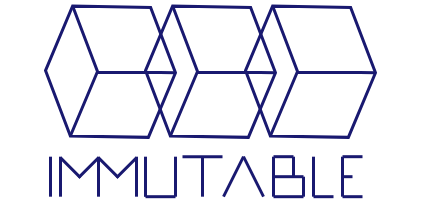

#  AutoLM Introduction

Welcome to the future of automated digital product sales
and activation! We believe software creators should be
in control of and directly compensated for their creations.
We believe software users want to be in control of their
purchased product activations as well as know their payment
goes directly to the creator of the products they purchase.
[ImmutableSoft Inc.](https://immutablesoft.org/) furthers
their goal of a future where software sales and distribution
are open and decentralized with the introduction of the
Automated License Manager, or AutoLM. Coupled with a
decentralized and publicly audit-able resale ecosystem,
digital product activations are transformed into digital
assets of increased value, while increasing overall
afford-ability and desirability.

Together with a software creator presence on the
[Immutable Ecosystem](https://ecosystem.immutablesoft.org),
the AutoLM empowers a software creators' application with
sales distribution and automation, creating a valuable digital
activation asset for each end user who purchases. Leveraging the
monetizable, decentralized and immutable Ethereum database,
AutoLM is able to automate the sales and/or activation processes
within a creator controlled license activation and
distribution ecosystem (ie. the Immutable Ecosystem).

# AutoLM Overview

AutoLM is an open source and commercial friendly (MIT license)
example of a secure license activation library that is
compatible with Immutable. The goals of AutoLM are to
be easy to use while following security best practices.

AutoLM is built (see [INSTALL.md](./INSTALL.md)) as a
C++ library to be linked together with the software or digital
creation to be licensed/sold. For cloud/server and/or scripting
language support there is optionally a set of command line
tools available for use.

When built/linked/integrated together with the digital
product that is to be licensed, AutoLM will enforce that a
purchased product license activation is in fact valid on the 
blockchain. The security of AutoLM works by utilizing a
globally unique, read only PC/OS identifier and cryptographically
tying it together with the unique entity and product information,
including a secret password from the software creator. This
process yields a unique activation identifier that is then 
used to identify if the installed software is 'active' and was
purchased on the Immutable Ecosystem.

AutoLM is designed to be integrated in one of two ways; standalone
or server assisted. Standalone used the installed software
application to create an initial local license activation file.
It is the simplest to deploy and is the basis for this
Quick Use Guide next. Server assisted moves the local license
file creation process to a secure server the creator controls
(JSON/REST interface, etc.). This gives additional security as
well as control to the license distribution process and can be
tied into the end user registration requirements of the
software creator. All the while still maintaining automation
of the process.

# Quick Use Guide

## Using libautolm, the C/C++ library

The first step to using the AutoLM library is to initialize
it with the entity and product information, as represented
on the Immutable Ecosystem. If you have not created an Entity
on Immutable you can test with one of the product examples on the
Ropsten testnet (ie. leave code unchanged). With the entity and
product reference from Immutable, call AutoLmInit() with a private
mode and password to initialize the library.

Once initialize the AutoLm object can be used to validate
a license file or create a local license activation file.
For a standalone situation usually AutoLmValidateLicense() is
called to start and if it returns a noLicenseFound error,
then the application creates a local activation with
AutoLmCreateLicense() before calling AutoLmValidateLicense()
again. On the second call to AutoLmValidateLicense() the
Ethereum database will be checked and if a new install the
blockchainExpiredLicense error will be returned, indicating
that this activation is not purchased/valid.

At this point the application can choose to handle the situation
however it pleases. At a minimum the application should display a
dialog box displaying the activation identifier and a link to the
Immutable Ecosystem. A better option is to provide an embedded
link into the Immutable Ecosystem that will open the purchase
activation page for that product with the end users activation
identifier auto populated for a 'one-click' purchase experience.

To integrate AutoLM into other payment options besides Immutable
there are two options, upgrade to EasyLM for a full license
management suite (contact ImmutableSoft for more information) or
have your sales process create activations within the Immutable
Ecosystem on behalf of your paying customers.

Below is the standalone example to launch the Immutable Ecosystem
with a link to an auto populated page for a 'one-click' customer
purchase experience. The parameters include the entity and
product id's as well as the end users activation identifier -
from the installed software local license file. The purchase page
URL into the Immutable Dapp is returned in purchaseUrl, which
may be useful (by the user and/or application) if the launch of
the Chrome browser to open the URL fails.

```
/***********************************************************************/
/* launchPurchaseDialog: Launch Dapp to activation purchase page       */
/*                                                                     */
/*      Inputs: entityId = entity ID static in Immutable Ecosystem     */
/*              productId = product ID static in Immutable Ecosystem   */
/*              activationId = local activation identifier to activate */
/*                             in hex string format                    */
/*      Output: purchaseUrl = the resulting URL to open purchase page  */
/*                                                                     */
/*     Returns: result of execution (launch), zero if success          */
/*                                                                     */
/***********************************************************************/
int launchPurchaseDialog(ui64 entityId, ui64 productId,
                         const char* activationId, char *purchaseUrl)
{
  char bufLink[200];
  char bufLaunch[250];
  char entityIdStr[21];
  char productIdStr[21];

  // Convert the entity and product IDs to string equivalent
  sprintf(entityIdStr, "%llu", entityId);
  sprintf(productIdStr, "%llu", productId);

  // Create the purchaseUrl result string if not NULL
  if (purchaseUrl)
  {
    sprintf(purchaseUrl,
      "https://ecosystem.immutablesoft.org/?func=activation&entity=%s&product=%s&identifier=%s&promo=0",
      entityIdStr, productIdStr, activationId);
  }

  // Create the URL with -app parameter for passing to the Chrome browser
  sprintf(bufLink,
    "--app=https://ecosystem.immutablesoft.org/?func=activation&entity=%s&product=%s&identifier=%s&promo=0",
    entityIdStr, productIdStr, activationId);
  PRINTF("bufLink - '%s'\n", bufLink);

  sprintf(bufLaunch, "start chrome.exe \"%s\"", bufLink);
  PRINTF("bufLaunch - '%s'\n", bufLaunch);
  int n = 0;
#ifndef _WINDOWS
  sprintf(bufLaunch, "/usr/bin/google-chrome \"%s\"", bufLink);
  PRINTF("lanching '%s'\n", bufLaunch);
  n = system(bufLaunch);
  PRINTF("n = %d\n", n);
#else
  PRINTF("lanching '%s'\n", bufLaunch);
  n = system(bufLaunch);
#endif
  PRINTF("n = %d\n", n);

  // Return system() call result (zero on success)
  return n;
}
```
To complete the standalone integration of AutoLM, below is the code
from the TestApplicaiton example included in Git repository. Note that
the AutoLmValidateLicense() function returns the result as well as the
expiration of the activation identifier as store on the block chain. It
also populates the activation identifier needed to purchase from Immutable
if the error blockchainExpiredLicense si returned.

```
int main()
{
   // Allocate the Automatic License Manager object
   AutoLm *lm = new AutoLm();
   if (lm)
   {
     time_t exp_date = 0;
     ui64 resultingValue;
     int licenseStatus;
     char vendorPassword[20 + 1];
     char buyHashId[44] = "";
     char purchaseUrl[244] = "";
     unsigned int nVendorPwdLength;

     // Reconfigure entity and product below to match Ecosystem
     const char* entityName = "CreatorAuto1"; //From Immutable Ecosystem
     const char* product = "GameProduct";
     ui64 entityId = 3; // From Immutable Ecosystem, static per application
     ui64 productId = 1; // From Immutable Ecosystem, static per application

     // Populate the Infura ID with your specific id
     const char* infuraId = INFURA_PROJECT_ID; // From https://infura.io

     // Populate the password by converting the string to bytes
     nVendorPwdLength = lm->AutoLmPwdStringToBytes("ThePassw\\0rd",
                                                   vendorPassword);

     // Initialize AutoLM object with entity, product, mode, password
     // and Infura id needed to verify activation on-chain
     lm->AutoLmInit(entityName, entityId, product, productId, 3,
                    vendorPassword, nVendorPwdLength, NULL, infuraId);

     // Loop to validate license activation (needed if we create an activation)
     for (;;)
     {
       switch (licenseStatus = lm->AutoLmValidateLicense(LICENSE_FILE,
                                 &exp_date, buyHashId, &resultingValue))
       {
         // If valid, display the activation expiration
         case licenseValid:
             Validated = true;
             sprintf(BufValidate,
                     "Activation for %s expires on %s", product,
                     ctime(&exp_date));
           break;

         // If no license file exists, create a local license activation
         case noLicenseFile:
         {
           int created = lm->AutoLmCreateLicense(LICENSE_FILE);
           if (created >= 0)
             continue; // Call Validate again after creating
           else
             break;
         }

         // If no license not valid on-chain/expired, launch Dapp to purchase
         case blockchainExpiredLicense:

           // launch browser to purchase from Immutable
           launchPurchaseDialog(entityId, productId, buyHashId, purchaseUrl);
           break;
         default:
           break;
       }
       break;
     }

     // If license is not valid then exit the application
     if (licenseStatus != licenseValid)
     {
       puts("This application requires a valid activation on-chain.");
       if (licenseStatus == blockchainExpiredLicense)
       {
         puts("\nYour browser (Chrome) was opened to the Immutable Ecosystem");
         puts("license activation purchase page for this application, passing");
         puts("your unique activation identifier. Please Purchase the activation");
         puts("from the Ecosystem to unlock this application running on your PC.");
         puts(purchaseUrl);
       }
       return -1;
     }
   }

   // Start application as it has a valid license
   ...
}
```

Be sure to link your application with AutoLm (-lautolm) as well
as any dependencies (curl, openssl, etc.). See the TestApplication
for an example of the these for your build environment. More
details on AutoLM is described below when discussing the command line
tools. In general, the Activate command uses AutoLmInit() and
AutoLmCreateLicense() within the AutoLm library, while the Validate
command uses AutoLmInit() and AutoLmValidateLicense().

# Command Tools for Scripting Languages

Due to the insecurity of passing parameters within
a scripting language, and the fact that AutoLm requires
a password as said parameter, scripting language applications of
AutoLM should be limited to servers which the creator
controls. Otherwise a keystore should be deployed (AWS, etc.)
to store the password and this keystore be kept under control
of the software creator. Alternatively, and only if supported
by the scripting language, bytecode may be generated for the
portion of the application that is to perform the license
activation check.

## Overview of Command Line Tools

To aid testing, debugging and integration with scripting
languages (Python, Perl, Tcl, etc.), the following command
line tools are created when AutoLM is built; 'compid', 'activate'
and 'validate'. The 'compid' is used by an application for
troubleshooting or when a server call is required to 'activate'
as the computer id must be passed from the PC executing the
software to the server creating the license file.

The 'activate' command creates a local license (file) using
the detected OS/PC computer id and the application details
(names, ids, secret). The 'validate' call requires a previously
created local license (file) and uses libcurl to validate the
license on the Ethereum network. Validate returns a string
representing the license activation value. Any number greater
than zero is active, any number greater than one (1)
is application specific (ie. an application feature or item).

## CompId - Globally Unique and Immutable Identifier

The foundation of AutoLM is the globally unique and immutable
identifier (computer id). From the physical hardware executing
the library, this identifier will never change for a physical
computer without a reinstall of the OS. This identifier also
cannot be easily faked or changed by the user (immutable). This
global unique and immutable OS identifier is used to create
system specific software license activations.

To encourage customization of this step, AutoLM supports integration
with any application defined computer id that returns a hex string
format equal to or less than 35 bytes long (32 byte value, 2 for
hex prefix '0x' and one for terminating character).

Using an application specific and unique computer id algorithm,
or chaining together user or additional system hardware information
with the default to create a more specific activation identifier.
It is perfectly acceptable that different applications create different
identifiers, but by default they will be identical as the requirement
is that the ID be unique per PC/OS, not application. After compilation
the computer id for the OS/PC can be retrieved with the CompId binary.

```
$ ./compid
0x313fc746359696cb41a3a4adb663c6fb
```

## Activate - Secure Unique Local Activation Install

The second action of the library is creating local license
activations for a particular user/system and product.
This action requires a secret password and selected algorithm
from the software creator. The simplest approach is to compile
these details (password, mode) into the application. For
additional security this second library can be hosted
through a REST/JSON interface on the software creators
website. This interface returns a created license in exchange
for the computer id (and possibly other information)
at runtime.

A local license activation is created locally, derived from the
application secret, product and computer id. However, this local
activation still requires registration on the global blockchain
before in can be considered globally active. This blockchain
activation step can thus require payment to the software creator
through the transfer of crypto-currency (ETH).

An example using the 'activate' command line tool to create a
license activation file is below.

```
./activate Mibtonix 3 Mibpeek 0 3 Passw\\0rd 0x5adb663c6fbb41a3a43fc74319696c63 ./license.elm
```

## Validate - Secure Blockchain Validation of Local Activation

The third action of the library validates a local activation
license (ensures computer id and hash match) and then
securely queries (HTTPS) the Ethereum network and verifies
the activation value. Only an activation value greater
than zero is considered valid and any value besides one
is considered a product feature. <b>The value one is reserved
for digital product activation purposes.</b> Different application
features can be available for purchase from the Immutable
Ecosystem and are distinguished by their Activation
Value. At no time after purchase can this Value be changed.

An example using the 'validate' command line tool to verify a
license activation file with the Ethereum database is below. Note
that the Infura Product Id (d3dddc6...1) is not a valid Infura Id.
Please register you or your organization with
[Infura](https://infura.io) to receive your own unique product
identifier that should be used within your application for product
validations.

```
./validate Mibtonix 3 Mibpeek 0 3 Passw\\0rd d3dddc623391479a2931dfbd17a744d1 ./license2.elm
1
```

Note the value above returns one (1) indicating the license is valid. If
the 'validate' command returns zero (0) then the activation is not
valid on the Ethereum database indicating a purchase (or activation
Move) from the Immutable Ecosystem is required.

# AutoLM Application Integration Notes

If found to not be valid on the Ecosystem, the application
should consider the installation unlicensed and report the
product identifier to the user and/or redirect the user
to a browser/tab into the Immutable Ecosystem to purchase
the activation (see launchBuyDialog() above). Once the user
purchases a new activation through the Immutable Ecosystem
the check will return valid and the application logic should
unlock the application feature(s). If the user already has an
activation they can navigate to the Immutable Activations page
and update their activation identifier to the new value.
Applications with many features may wish to consider a bulk
migration feature.


